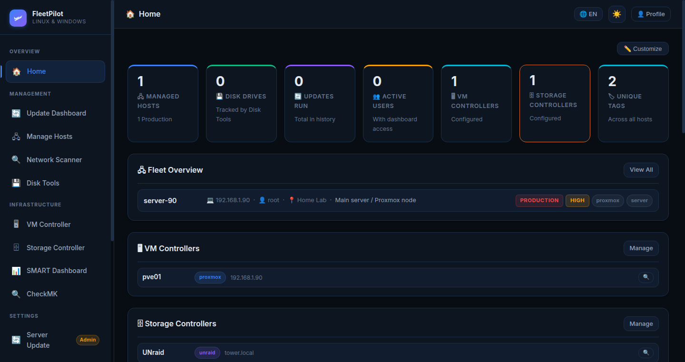
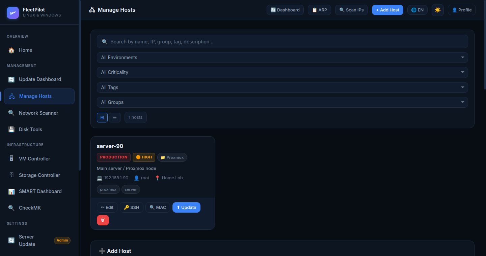
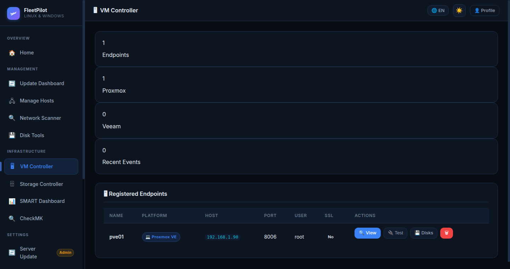
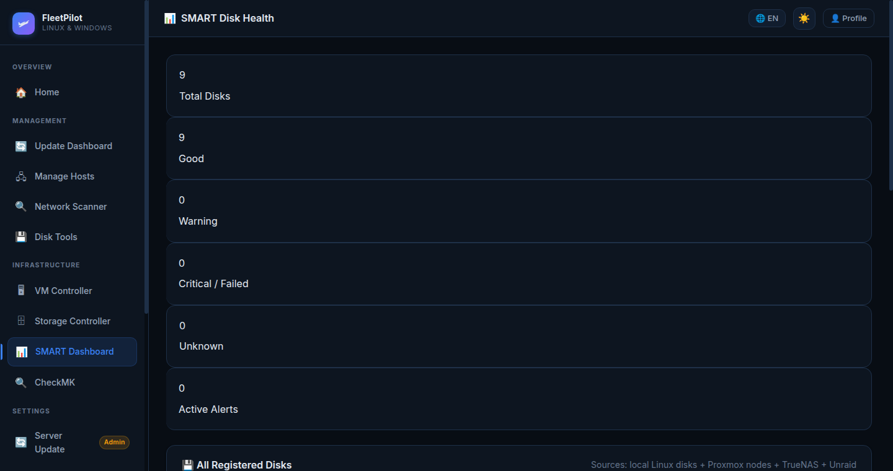

<div align="center">



# FleetPilot

**The self-hosted fleet management dashboard for homelabs and small IT teams.**

Manage Linux & Windows servers, VMs, storage systems, and disks — all from one responsive dark-mode web UI.

[](LICENSE)
[](https://python.org)
[](https://flask.palletsprojects.com)
[](https://github.com/ChristianHandy/FleetPilot)

[Features](#features) · [Screenshots](#screenshots) · [Quick Start](#quick-start) · [User Guides](#user-guides) · [Security](#security)

</div>

---

## What is FleetPilot?

FleetPilot is a modern, self-hosted web dashboard that gives you a single pane of glass over your entire infrastructure. Whether you run a homelab with a few Raspberry Pis or manage dozens of servers, FleetPilot keeps everything under control — without any cloud dependency or subscription fee.

It combines remote update management, disk health monitoring, VM controller integration (Proxmox), storage controller integration (TrueNAS), and CheckMK monitoring into one unified interface with multi-user RBAC and a fully customizable dashboard.

---

## Features

| Category | Capabilities |
|---|---|
| **Dashboard** | Fully customizable widget layout (drag & drop, per-user persistence) |
| **Host Management** | Linux & Windows servers, tags, environments, DHCP/MAC tracking |
| **Remote Updates** | SSH-based updates for Ubuntu, Debian, Fedora, Arch, Windows (winget) |
| **VM Controllers** | Proxmox integration with retry/backoff, VM status overview |
| **Storage Controllers** | TrueNAS and custom storage system management |
| **Disk & SMART** | Format (ext4/XFS/FAT32), SMART tests, block validation, history |
| **CheckMK** | Monitoring integration with token authentication |
| **User Management** | Multi-user RBAC (Admin / Operator / Viewer), profile management |
| **Plugins** | Extensible addon system with remote plugin repository |
| **Scheduling** | Automatic updates (daily/weekly/monthly) with email notifications |
| **i18n** | Interface available in EN, DE, FR, ES, NL |

---

## Screenshots

<table>
<tr>
<td width="50%">

**Customizable Dashboard**


</td>
<td width="50%">

**Host Management**


</td>
</tr>
<tr>
<td width="50%">

**VM Controllers (Proxmox)**


</td>
<td width="50%">

**SMART Disk Health**


</td>
</tr>
</table>

---

## Quick Start

### Requirements

- Python 3.8+
- Linux (recommended) or Windows
- `smartmontools`, `parted`, `e2fsprogs` for disk features (optional)

### Installation

```bash
# 1. Clone the repository
git clone https://github.com/ChristianHandy/FleetPilot.git
cd FleetPilot

# 2. Create and activate a virtual environment
python3 -m venv venv
source venv/bin/activate  # Windows: venv\Scripts\activate

# 3. Install dependencies
pip install -r requirements.txt

# 4. Configure environment
cp .env.example .env
# Edit .env: set SECRET_KEY, DASHBOARD_USERNAME, DASHBOARD_PASSWORD

# 5. Run
python3 app.py
# For disk management features: sudo -E python3 app.py
```

Open `http://localhost:5000` in your browser and log in.

> **Production deployment:** Use Gunicorn behind Nginx/Traefik with TLS. See the [Security](#security) section.

---

## Customizable Dashboard

The dashboard is fully customizable — every user can arrange their own layout:

1. Click **"✏️ Customize"** in the top-right corner
2. **Drag & drop** widgets into any order
3. **Hide** widgets with the red ✕ button; restore them from the "Hidden Widgets" panel
4. Click **"💾 Save Layout"** — persisted per user in the database
5. **"↺ Reset"** restores the default layout

Available widgets: Quick Stats, Fleet Overview, VM Controllers, Storage Controllers, SMART Health, Environment Breakdown, Tag Cloud, Recent Updates, Navigation Cards, Plugin Widgets.

---

## User Guides

Official user guides with screenshots are available in 5 languages under [`docs/user-guides/`](docs/user-guides/):

| Language | Download |
|---|---|
| English | [FleetPilot_User_Guide_EN.pdf](docs/user-guides/FleetPilot_User_Guide_EN.pdf) |
| Deutsch | [FleetPilot_Handbuch_DE.pdf](docs/user-guides/FleetPilot_Handbuch_DE.pdf) |
| Français | [FleetPilot_Guide_Utilisateur_FR.pdf](docs/user-guides/FleetPilot_Guide_Utilisateur_FR.pdf) |
| Español | [FleetPilot_Manual_Usuario_ES.pdf](docs/user-guides/FleetPilot_Manual_Usuario_ES.pdf) |
| Italiano | [FleetPilot_Manuale_Utente_IT.pdf](docs/user-guides/FleetPilot_Manuale_Utente_IT.pdf) |

---

## Architecture

FleetPilot is a Python/Flask application with a SQLite backend. It requires no external database server or cloud service.

```
FleetPilot/
├── app.py                  # Main Flask application & all routes
├── vm_controller.py        # Proxmox/VM integration (with retry backoff)
├── user_management.py      # RBAC, users, dashboard layout persistence
├── storage_controller.py   # Storage system integration
├── smart_manager.py        # SMART disk health monitoring
├── checkmk_integration.py  # CheckMK monitoring integration
├── disktool_core.py        # Disk formatting & validation
├── templates/              # Jinja2 HTML templates
├── static/                 # CSS, JS, assets
├── addons/                 # Plugin system
└── docs/
    ├── user-guides/        # Multilingual PDF user guides
    └── screenshots/        # UI screenshots
```

---

## Security

FleetPilot manages critical infrastructure. Before deploying:

- **Always use HTTPS/TLS** — deploy behind Nginx/Traefik/Caddy with a valid certificate
- **Restrict network access** — management VLAN or VPN only, never expose to the public internet
- **Set strong credentials** — generate a secure `SECRET_KEY` with `openssl rand -hex 32`
- **Use Gunicorn** in production, not the Flask dev server
- **Limit sudo scope** — grant `sudo` only for specific disk utilities (`smartctl`, `mkfs.*`, `wipefs`)

See [SECURITY.md](SECURITY.md) for the full hardening guide.

---

## Managing Hosts

Hosts are stored in `hosts.json`. The web UI at `/hosts` lets you add, edit, and delete hosts without touching the file directly.

```json
{
  "my-server": { "host": "192.168.1.50", "user": "ubuntu", "mac": "00:11:22:33:44:55" },
  "windows-pc": { "host": "192.168.1.60", "user": "Administrator" }
}
```

**DHCP support:** Store the MAC address and use "Scan for IP Changes" to automatically update host IPs when they change.

---

## Plugin System

Extend FleetPilot with custom disk tools and integrations via the addon system. Install plugins from the web UI at `/disks/pluginmanager/` or create your own — see [PLUGIN_REPOSITORY.md](PLUGIN_REPOSITORY.md).

---

## Contributing

Pull requests are welcome. For major changes, please open an issue first to discuss what you would like to change.

---

## License

[MIT](LICENSE) — free to use, modify, and self-host.

---

<div align="center">

Made with care for the homelab community.

⭐ If FleetPilot is useful to you, consider starring the repository — it helps others find it.

</div>
